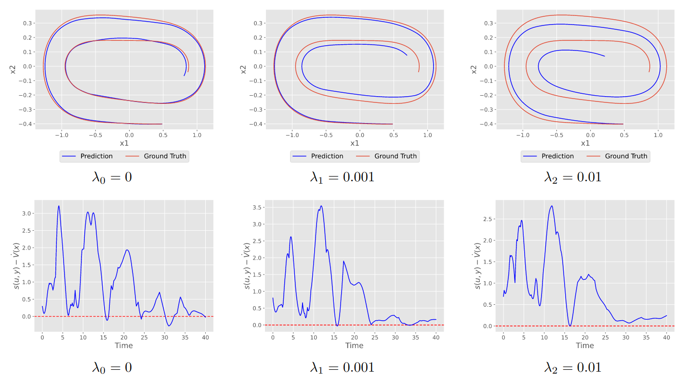

# Dissipative Neural Networks

This repository contains the code for our paper "[Dissipative Neural Networks for Modeling Distributed Nonlinear Systems](Paper.pdf)".

### Dissipativity
[Dissipativity](https://en.wikipedia.org/wiki/Dissipative_system) is a concept from systems and control theory to 
describe the input output behaviour of a non-linear dynamical system. Input-output properties like finite L2 gain and passivity
can be expressed as a form of dissipativity (see [here](https://link.springer.com/article/10.1007/BF00276493) for a more 
in-depth explanation). 

A dynamical system with the state dynamics $\dot{x}= f(x,u)$ and output $y=g(x,u)$ (where $x$ is the state of the system 
and $u$ is an input to the system is called dissipative if there exists a storage function $V(x)$ such that
$\dot{V}(x)\le s(u,y)$. The storage function can be interpreted as a kind of energy stored in the system and
the supply rate represents energy supplied to and removed from the system via its input $u$ and output $y$.
The inequality above therefore states that the change in energy of the system at any point in time must be less than
or equal to the rate at which energy is supplied to the system.

Dissipativity has important links to system stability and is therefore an important tool in control theory.

### Neural Dynamical Models
We model distributed dynamical systems with the help of neural networks. The basis for our neural network model is
taken from the paper "[Structural Inference of Networked Dynamical Systems with Universal
Differential Equations](https://arxiv.org/abs/2207.04962)" where a networked dynamical system is modeled with
two neural networks, one modeling the physics of each node and one modeling the coupling physics between connected
nodes. The neural network model is trained to minimize the difference between the predicted state dynamics and the
actual state dynamics of the system.

### Dissipative Neural Networks
We introduce a new dissipativity loss function to the training process which ensures that the neural network model
captures the dissipative properties of the system to be modeled. This loss function is directly based on the dissipativity
inequality mentioned above. 

The resulting neural network models are significantly better at modeling dissipativity of the system while, if the relative
weight $\lambda$ of the dissipativity loss to the MSE loss is chosen correctly, not sacrificing the accuracy of the modeled system
trajectories.

